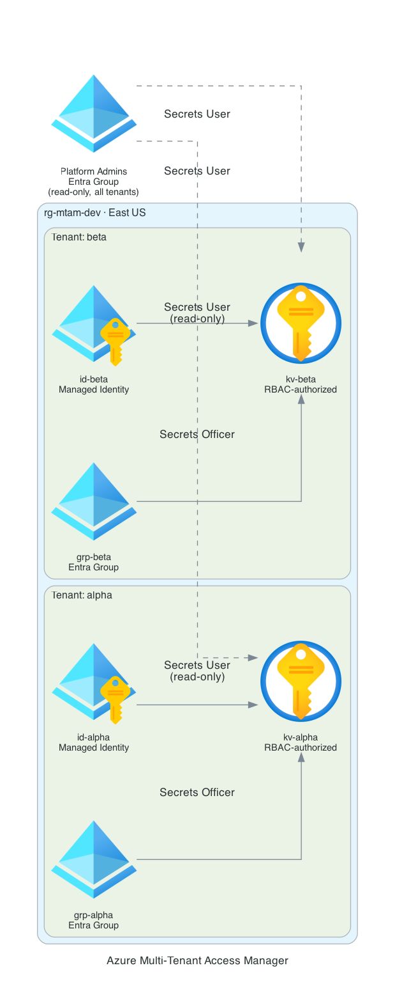

# Azure Multi-Tenant Access Manager

Terraform-governed access-control plane for multi-tenant Azure workloads. Each tenant (workload team) is onboarded as a unit: an isolated Key Vault, a user-assigned managed identity scoped read-only to its own vault, and an Entra ID security group with secrets-management rights. A cross-tenant platform-admin group holds read-only governance across every vault. All access is Azure RBAC, so every grant is an auditable role assignment, not an opaque access policy.

## Architecture



| Component | Resource | Purpose |
|---|---|---|
| Tenant Key Vault | `kv-{tenant}-{suffix}` | Isolation boundary — one vault per tenant, RBAC-authorized |
| Tenant Identity | `id-mtam-{tenant}-{env}` | User-assigned managed identity = the workload boundary |
| Tenant Group | `grp-mtam-{tenant}-{env}` | Entra security group = the human/team boundary |
| Platform Group | `grp-mtam-platform-admins-{env}` | Cross-tenant read-only governance group |
| RBAC | Role assignments scoped to each vault | Least-privilege access matrix (below) |
| Seed Secret | `{tenant}-app-config` | Auto-generated secret proving the data plane works |

### Access matrix

| Principal | Scope | Role | Effect |
|---|---|---|---|
| Tenant managed identity | Its own vault | Key Vault Secrets User | Workload reads its own secrets, nothing else |
| Tenant group | Its own vault | Key Vault Secrets Officer | Team manages its own secrets |
| Platform-admins group | Every tenant vault | Key Vault Secrets User | Central read-only audit across tenants |
| Deployer (Terraform principal) | Every tenant vault | Key Vault Secrets Officer | Seeds secrets during apply |

A tenant's identity has **zero** access to any other tenant's vault. Onboarding or offboarding a tenant is a single map entry.

## Features

- **Per-tenant isolation** — one Key Vault per tenant, no shared secret surface
- **RBAC authorization only** — `enable_rbac_authorization = true`, no access policies; every grant is an auditable Azure role assignment
- **Least-privilege matrix** — workload identities are read-only and scoped to a single vault; only team groups can write
- **Managed identity auth** — workloads authenticate with no stored credentials
- **Central governance** — platform-admins group has read-only visibility across all tenants without ownership
- **RBAC-propagation guard** — a `time_sleep` between role assignment and first secret write eliminates the eventual-consistency 403 race
- **Generated secrets** — seed secrets are created with `random_password`, never hardcoded
- **Map-driven onboarding** — add a tenant by adding one entry to the `tenants` variable
- **OIDC CI/CD** — GitHub Actions authenticates to Azure via federated identity, no stored credentials

## Prerequisites

- Azure subscription with `Owner` (or `Contributor` + `User Access Administrator`) on the target scope
- Permission to create Entra ID security groups (Global Administrator, Groups Administrator, or equivalent)
- Azure Storage account for Terraform remote state (see [Backend Setup](#backend-setup))
- Terraform >= 1.6
- Azure CLI (for local runs)

## Backend Setup

Terraform state is stored in Azure Blob Storage. Create the backend resources once:

```bash
az group create --name rg-tfbackend-jordprojs --location eastus
az storage account create \
  --name sttfbejordprojs8557 \
  --resource-group rg-tfbackend-jordprojs \
  --sku Standard_LRS \
  --min-tls-version TLS1_2
az storage container create \
  --name tfstate \
  --account-name sttfbejordprojs8557 \
  --auth-mode login
```

## Deploy

```bash
az login

cd terraform
terraform init

# Plan with the default two tenants (alpha, beta)
terraform plan -out=tf.plan

# Or onboard your own tenants
terraform plan -out=tf.plan \
  -var='tenants={ payments = { description = "Payments team" }, search = { description = "Search team" } }'

terraform apply tf.plan
```

## Verify

Confirm the access model after apply:

```bash
RG=$(terraform output -raw resource_group_name)

# Every vault should report RBAC authorization = True
az keyvault list -g "$RG" \
  --query "[].{name:name, rbac:properties.enableRbacAuthorization}" -o table

# Inspect the role matrix on a tenant vault
az role assignment list \
  --scope "$(az keyvault show -n <vault-name> --query id -o tsv)" \
  --query "[].{principal:principalId, role:roleDefinitionName}" -o table

# Read a seeded secret (data-plane proof)
az keyvault secret show --vault-name <vault-name> --name <tenant>-app-config \
  --query "{name:name, type:contentType}" -o json
```

Isolation check: a tenant's managed identity principal ID should return **no** assignments when queried against another tenant's vault scope.

## Variables

| Variable | Default | Description |
|---|---|---|
| `location` | `eastus` | Azure region |
| `environment` | `dev` | Environment label / name suffix |
| `tenants` | `{ alpha, beta }` | Map of tenants to onboard; each key is the tenant slug used in resource names |
| `seed_secret_length` | `32` | Length of the auto-generated per-tenant seed secret |

## CI/CD

GitHub Actions deploys via OIDC (no stored credentials). Configure these repository secrets:

| Secret | Description |
|---|---|
| `AZURE_CLIENT_ID` | App registration client ID (federated credential) |
| `AZURE_TENANT_ID` | Entra ID tenant ID |
| `AZURE_SUBSCRIPTION_ID` | Target subscription ID |

Pull requests run `fmt`, `validate`, and `plan`. Pushes to `main` run `apply`.

## Outputs

| Output | Description |
|---|---|
| `resource_group_name` | Resource group holding all tenant resources |
| `platform_admin_group_object_id` | Object ID of the cross-tenant governance group |
| `tenant_key_vault_uris` | Per-tenant Key Vault URIs |
| `tenant_identity_client_ids` | Per-tenant managed identity client IDs |
| `tenant_identity_principal_ids` | Per-tenant managed identity principal IDs |
| `tenant_group_object_ids` | Per-tenant Entra group object IDs |

## Tech Stack

- **Terraform** `>= 1.6` · `azurerm ~> 3.100` · `azuread ~> 2.47` · `random ~> 3.0` · `time ~> 0.11`
- **Azure Key Vault** — standard SKU, RBAC authorization, soft delete
- **Azure Managed Identity** — user-assigned, per-tenant workload identity
- **Entra ID** — security groups for team and platform-admin boundaries
- **Azure RBAC** — Key Vault Secrets User / Officer scoped per vault
- **GitHub Actions** — OIDC federated auth, `hashicorp/setup-terraform@v3`
